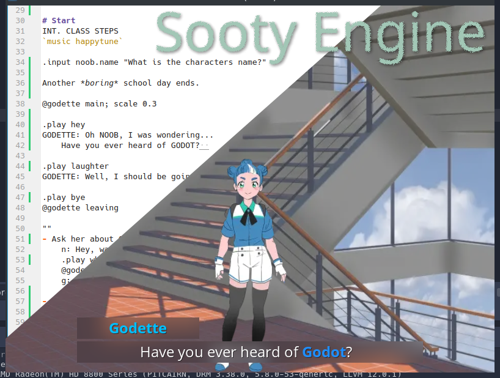

# Sooty Engine `0.1`



*Sooty Engine* aims to be an easy to read and write branching story engine.

While still in ealy dev, you can, right now, have a fully working visual novel, with menus, achievements, and everything.
All you need is to add your images and sounds to the appropriate folders, write a script in markdown, and compile. Boom.

Current features:
- Scripting language
- Dialogue system, with branching and rollback
- Achievements, quests, & rewards
- Audio with automatic fading
- Menus for save, load, settings, & credits
- Persistent data + settings
- Resource management
- Date & time
- Hot Reload (not super stable)

Coming features:
- Inventory & equipment
- Story graph & meta data
- Localization
- Maps
- 3D Stuff
- Audio effects
- Tons!

# Resources
Sooty allows a lot of laziness, so you can focus on desiging instead of organizing.

A sound file at:  
`res://audio/sfx/My Jingle 3 (credit=soundzzz.gov).mp3`  
can be got with:  
`Resources.sound("my_jingle")` or  
`Resources.sound("jingle")` or  
`Resources.sound("My Jingle 3")`

And if you later moved `My Jingle 3` to `res://audio/jingles/My Jingle 3...` everything would still work.

# SootyScript `wip`
SootyScript is based on Markdown. Aiming to be as human readable/writable as possible.

Markdown styles `*italic*`, `**bold**`, and `***bold italic***` are converted to bbcode: `[i]italic[/i]`, `[b]bold[/b]`, and `[b][i]bold italic[/b][/i]`.


```
# _init_
chose_to_restart = false

# Chapter Name
Here is a line of text.
John: Here is a spoken line.
->

# Chapter 2
Here is the 2nd chapter.

if chose_to_restart:
  This isn't you first time to this chapter.

Where do you want to go next?
- Restart this one `if not chose_to_restart`
  `chose_to_restart = true`
   -> The Next Chapter
- Chapter 3 -> Chapter 3
- The End -> The End

# Chapter 3
Chapter 3 has a random animal speaking!

?
- Chicken: Bawk, bawk.
- Cow: Moo.
- Dog: Meow.

->

# Chapter 4 - Moving Objects
Let's play some music.

.music "My Song" volume=0.5 fade=in

Let's show an image.

@icon

Let's move it to the right.

@icon; move right

->

# The End
The end of the story.
.show_menu
```

# Setting Up
Because of the early build state, there is no clean install other than this test project.  

Simply download and modify it if you like.

Soon things will stabilize.
